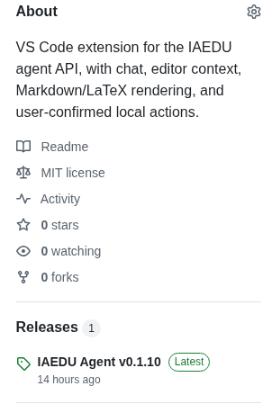
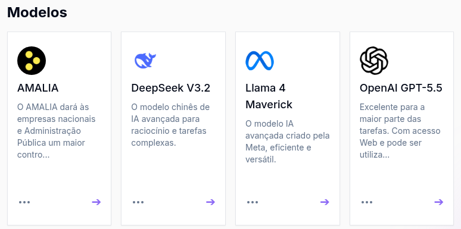
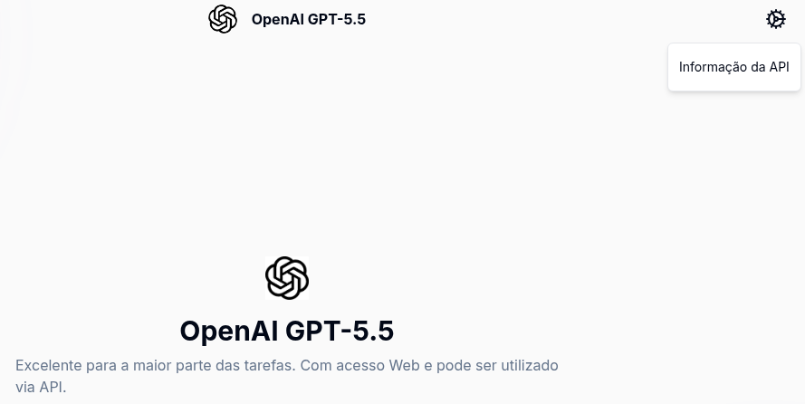
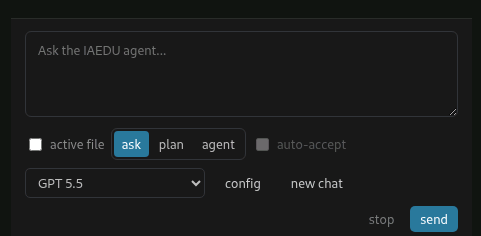
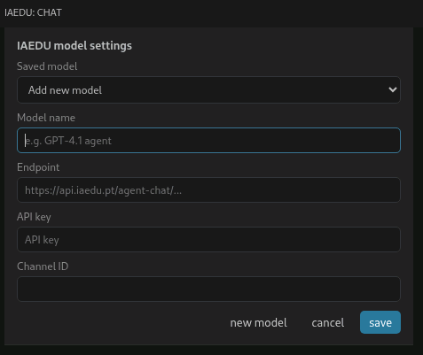

# IAEDU Agent for VS Code

IAEDU Agent for VS Code is a local VS Code extension that connects an editor
workspace to the IAEDU `agent-chat` API. It is intended for users who already
have IAEDU access through an eligible institution and want to use IAEDU while
reading, writing, analyzing, or editing project files in VS Code.

The extension is currently available only for VS Code.

Author: Miguel Portela, Universidade do Minho
<miguel.portela@eeg.uminho.pt>.

## What It Does

- Opens an IAEDU chat panel in the VS Code Activity Bar.
- Sends chat prompts to the IAEDU API.
- Can include the current selection or active file as local context.
- Streams IAEDU responses into the panel.
- Renders Markdown and LaTeX math in chat responses.
- Keeps one `thread_id` per workspace and can start a new thread.
- Provides three working modes: `ask`, `plan`, and `agent`.
- Stores API keys in VS Code SecretStorage, not in repository files.
- Supports optional `.env` import for local development.
- In `agent` mode, applies proposed local actions only after guardrail checks
  and, where needed, user review.

No IAEDU endpoint, channel ID, API key, or institution-specific configuration
is included in this repository.

## Requirements

For normal use:

- VS Code 1.100 or newer.
- IAEDU access through a participating institution.
- IAEDU API connection details for the model or agent you want to use:
  endpoint, API key, and channel ID (`channel_id`).

For source builds:

- Node.js and npm. The GitHub Actions build currently uses Node.js 22.
- Git, if you are cloning the repository rather than downloading a source ZIP.

## IAEDU Background

IAEDU is an FCT/FCCN platform for higher education and research in Portugal.
Public IAEDU material describes it as a service that centralizes access to
multiple artificial intelligence models and uses federated institutional
authentication. Access is intended for users from participating institutions
and is subject to IAEDU's responsible use policy.

Official IAEDU sources:

- IAEDU home page: <https://www.iaedu.pt/>
- IAEDU usage page: <https://iaedu.pt/pt/como-utilizar>
- IAEDU documentation: <https://docs.iaedu.pt/>
- IAEDU access guide: <https://docs.iaedu.pt/books/bem-vindo-ao-iaedu/page/como-aceder>
- IAEDU agents guide: <https://docs.iaedu.pt/books/funcionalidade-agentes/page/como-criar-agentes>
- IAEDU API example: <https://docs.iaedu.pt/books/funcionalidade-api/page/exemplo-python>

## Install From a Release

This is the recommended path for most users. It does not require Git, Node.js,
or npm, provided that a packaged `.vsix` file is available on the GitHub
Releases page.

1. Open the repository page in a browser.
2. Go to the latest release.

   

3. Download the latest `iaedu-agent-*.vsix` file.
4. Open VS Code.
5. Open the Command Palette with `View > Command Palette...`.
6. Run `Extensions: Install from VSIX...`.
7. Select the downloaded `.vsix` file.
8. Reload VS Code if prompted.

The GitHub `Code > Download ZIP` option downloads the source code, not an
installable extension package. Use the release `.vsix` file when you only want
to install the extension.

## Install From Source

Use this path if you want to build the extension yourself or install from a
source ZIP instead of a release package.

1. Clone the repository:

   ```bash
   git clone https://github.com/reisportela/iaedu.git
   cd iaedu
   ```

   If you downloaded a source ZIP, unzip it and open a terminal in the unzipped
   folder instead.

2. Install dependencies:

   ```bash
   npm install
   ```

3. Compile the extension:

   ```bash
   npm run compile
   ```

4. Run the tests:

   ```bash
   npm run test
   ```

5. Build the VSIX package:

   ```bash
   npm run package
   ```

6. Install the generated package in VS Code. From a Linux or macOS shell:

   ```bash
   code --install-extension iaedu-agent-*.vsix --force
   ```

   You can also install the generated `.vsix` through VS Code with
   `Extensions: Install from VSIX...`.

7. Reload VS Code if prompted.

## Get IAEDU API Details

Before configuring the extension, obtain the IAEDU connection details for the
model or agent you intend to use.

1. Go to <https://www.iaedu.pt/> or directly to <https://chat.iaedu.pt/>.
2. Sign in with institutional credentials.

   

   IAEDU uses federated authentication, so users do not need to create a
   separate IAEDU account.

3. Choose the AI model that fits the task.

   

   IAEDU documentation explains that different models have different strengths,
   so the model choice should match the academic, research, or coding task.

4. For agent workflows, create or configure an IAEDU agent in the IAEDU web
   platform. The IAEDU agent guide covers naming the agent, describing its
   purpose, writing a system prompt, choosing a model, optionally adding
   knowledge-base files, and testing with realistic questions.

5. Open the API information for the selected model or agent.

   

6. Record the endpoint, API key, and channel ID (`channel_id`).

   

Availability of API access may depend on the selected model, IAEDU
configuration, and institutional policy. This extension does not request,
generate, or bundle IAEDU credentials.

## Configure the Extension

After installing the extension, create at least one local IAEDU model profile.
A model profile is the local configuration that tells the extension which IAEDU
model or agent to call.

1. Open the IAEDU panel from the VS Code Activity Bar.

   

   You can also open it from the Command Palette:

   ```text
   IAEDU: Open Chat
   ```

2. In the IAEDU panel, select `config` or `sign in`.

   

3. Add a model profile.

   

4. Enter the profile details:

   - Model name: a local display name, such as `IAEDU default model`.
   - Endpoint: the IAEDU `agent-chat` endpoint.
   - API key: the IAEDU API key for this model or agent.
   - Channel ID: the IAEDU channel ID (`channel_id`).

5. Save the profile and select it in the IAEDU panel.

Model names, endpoints, and channel IDs are stored in VS Code workspace
settings. API keys are stored per profile in VS Code SecretStorage.

You can manage configuration with these Command Palette commands:

```text
IAEDU: Sign In / Configure API
IAEDU: Select Model
IAEDU: Set Endpoint
IAEDU: Set API Key
IAEDU: Set Channel ID
IAEDU: Sign Out
```

`IAEDU: Sign Out` removes local IAEDU model profiles and their stored API keys.

## Optional Local Development Setup

For local development, you can import placeholder-based configuration from an
untracked `.env` file.

1. Copy `.env.example` to `.env`.
2. Fill in your own IAEDU endpoint, channel ID, API key, and optional model
   name.
3. Run this Command Palette command:

   ```text
   IAEDU: Import Settings from .env
   ```

Never commit `.env` or real IAEDU credentials.

## Workspace Instructions

If the open VS Code workspace contains an `IAEDU.md` file at its root, the
extension automatically includes that file as local project instructions for
requests sent from the workspace. This is optional:

- Requests still work when `IAEDU.md` is absent.
- The extension does not search for `IAEDU.md` outside the open workspace.
- `IAEDU.md` is useful for project-specific coding, writing, data, or review
  instructions that should apply consistently to IAEDU requests.

## Use the Extension

Open the IAEDU panel from the Activity Bar or run:

```text
IAEDU: Open Chat
```

Type a prompt, select a model profile, and choose a mode:

- `ask`: direct questions and ordinary chat.
- `plan`: read-only analysis and implementation planning.
- `agent`: guarded local actions proposed by IAEDU.

Use `active file` to include the current editor file as context. To ask about
selected text, right-click the selection and run:

```text
IAEDU: Ask About Selection
```

To reset the IAEDU conversation thread for the current workspace, run:

```text
IAEDU: Start New Thread
```

## Extension Modes

### `ask`

Use this mode for ordinary questions. The extension can include local context,
but it does not ask IAEDU to propose file edits or commands.

### `plan`

Use this mode for read-only analysis and implementation planning. It is useful
when you want IAEDU to inspect context, explain a problem, propose a plan, or
list validation steps before any local action is taken.

### `agent`

Use this mode when IAEDU may propose local actions. The extension recognizes
fenced `iaedu-action` blocks and presents the actions in the panel. Local
actions are constrained by guardrails before anything is applied.

Supported local action format:

```iaedu-action
{
  "actions": [
    {
      "type": "writeFile",
      "path": "relative/path.txt",
      "content": "content"
    },
    {
      "type": "appendFile",
      "path": "script.do",
      "content": "\nregress mpg weight"
    },
    {
      "type": "replaceSelection",
      "content": "new text"
    },
    {
      "type": "runCommand",
      "command": "npm test"
    }
  ]
}
```

## Guardrails

The extension is deliberately conservative. Local actions must stay inside the
open workspace. The extension blocks or requires review for sensitive paths and
commands.

Auto-accept is available only in `agent` mode and applies guarded low-risk
actions inside the open workspace. It accepts small writes or appends to
non-sensitive workspace text files, common non-destructive development and
analysis commands such as test/build scripts, Python checks or workspace
scripts, R scripts and package checks, Julia workspace scripts or package
tests, and Stata batch `.do` files.

Commands must remain simple single commands with workspace-local paths.
Auto-accept does not allow bulk-style writes, outside-workspace edits, system
package installation, system file changes, destructive shell patterns,
privileged commands, command pipes, redirects, or shell expansion.

Examples of blocked or restricted behavior include:

- writing outside the workspace;
- writing to protected paths such as `.git`, `.ssh`, or environment and
  configuration files without review;
- large automatic writes;
- `sudo`, system package managers, service managers, and recursive permission
  changes;
- destructive Git commands such as `git reset --hard` and `git clean -f`;
- download-and-execute command patterns such as `curl ... | sh`.

## Mathematical Expressions

The response panel renders LaTeX mathematical expressions with KaTeX after
Markdown rendering. It supports common inline and display formats:

- inline: `$x^2 + y^2 = z^2$`
- inline: `\(x^2 + y^2 = z^2\)`
- display: `$$\int_0^1 x^2\,dx = \frac{1}{3}$$`
- display: `\[\int_0^1 x^2\,dx = \frac{1}{3}\]`

Math rendering is skipped inside code blocks and inline code so programming
examples remain unchanged.

## Development in VS Code

Open this repository in VS Code and press `F5`. The included launch
configuration starts an Extension Development Host and compiles the extension
before launch.

The standard local validation loop is:

```bash
npm run compile
npm run test
npm run package
```

## GitHub Release Packaging

This repository includes a GitHub Actions workflow that builds and tests the
extension, uploads the `.vsix` as a workflow artifact, and attaches it
automatically to a published GitHub Release.

## Repository Contents

- `src/`: TypeScript extension source.
- `media/`: webview JavaScript, CSS, and icons.
- `test/`: extension behavior tests.
- `.vscode/`: development launch and task configuration.
- `.vscodeignore`: files excluded from the VSIX package.
- `.env.example`: placeholder IAEDU configuration keys.
- `LICENSE`: MIT license.

Generated folders and artifacts such as `node_modules/`, `dist/`, and `*.vsix`
are ignored and should not be committed.

## License

This project is released under the MIT license. See `LICENSE`.
